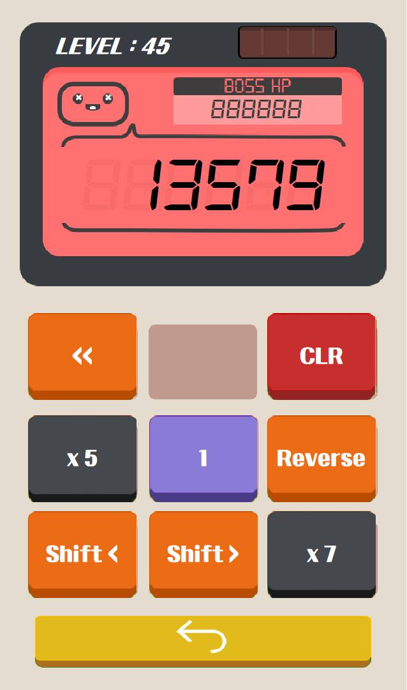

# C-calculator-game

플레이 스토어에 있는 [계산기 게임](https://play.google.com/store/apps/details?id=com.sm.calculateme)을 C언어로 오마주(?)한 작품입니다.

계산기의 버튼을 가지고 제한된 이동 안에 목표 수로 만들면 성공인 게임입니다.

원작에 없는 "보스" 스테이지도 추가하였는데, 5의 배수 레벨마다 등장하며, 모든 버튼을 한 번씩만 사용해서 BOSS HP보다 크거나 같은 수를 만들면 승리하게 됩니다.

### 스크린샷

메인화면

  

조작법

레벨 선택창

인게임

